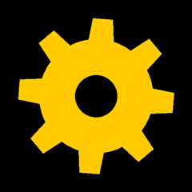
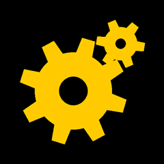
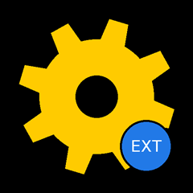
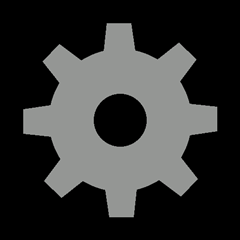
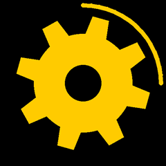
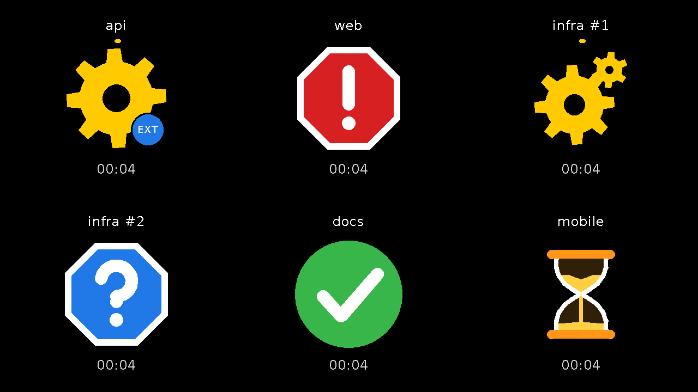
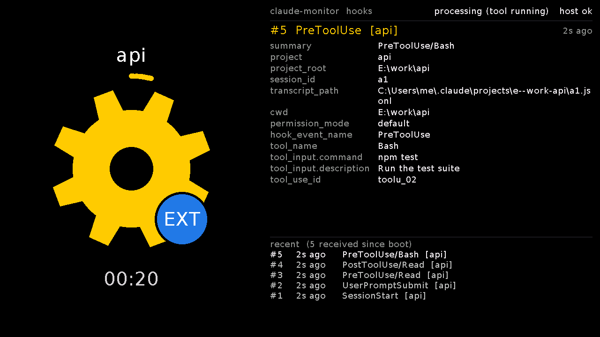

# claude-monitor

A desk status light for [Claude Code](https://claude.com/claude-code), on M5Stack hardware. Claude Code's hooks report every lifecycle event to a small daemon on your machine; the daemon keeps the USB serial port open and tells the device what Claude is doing. You see from across the room whether Claude is working, waiting for a permission, asking you something, done, or stuck on an error, and you stop tabbing back to the terminal every thirty seconds.

Two devices are supported by the same firmware component and the same daemon:

- the **M5Stack AtomS3R**, a 24 mm cube with a 128×128 display: one icon, the most urgent state among your sessions, kept upright by the accelerometer as you turn it;
- the **M5Stack Tab5**, a 5" tablet: one tile per Claude Code session (up to six), each with the project's name, its icon and a clock, and a tap on a tile opens a page with every field of the last hook event for that session. It turns with gravity like a tablet and beeps when a red icon appears.

Native **ESP-IDF 5.5** (C++ / CMake / FreeRTOS). No Arduino, no PlatformIO, no Wi-Fi, no soldering. The host side is three PowerShell 7 scripts. Everything the pictures below show was captured from the Tab5 itself (`tools/Make-ReadmeImages.ps1`); the AtomS3R draws the same icons at 128 px.

In a hurry? Go to [Installing, step by step](#installing-step-by-step).

## What it shows

Every state is one icon, chosen so that it reads from a distance: shape and colour both carry the meaning.

| Icon | State | What it means | What triggers it (Claude Code hook) |
|---|---|---|---|
|  | **Processing** (`processing`) | Claude is working on your request: thinking, reading, writing. The gear spins. | `UserPromptSubmit`, `PreToolUse`, `PostToolUse`, `PostToolUseFailure`, `PostToolBatch`, `PostCompact` (auto), `Notification` `quota_auto_resume_fired` |
|  | **Processing with subagents** | The gear shrinks and gains a counter-rotating satellite while one or more subagents run under this session. The count resets when the turn ends. | `SubagentStart` / `SubagentStop` |
|  | **External tool running** (EXT badge) | A process started by a tool is alive right now: a build, a test run, a shell command, as opposed to the model thinking. The daemon sees the process appear, which is also how it knows you approved a permission. | the daemon's process watching (`tool_start` / `tool_stop`) |
|  | **Compacting** (`compacting`) | Claude Code is compacting the context; back in a moment. Grey, spinning. | `PreCompact` |
|  | **Waiting for you** (`waiting_user`) | A permission prompt is on the terminal, or a usage-limit resume needs Enter. Pulses three times when it appears; the Tab5 plays a rising two-tone beep. | `Notification` `permission_prompt`, `quota_auto_resume_stale` |
|  | **Question** (`question`) | Claude asked you something (`AskUserQuestion`), or an MCP server or a background agent needs your input. Pulses. | `PreToolUse` `AskUserQuestion`, `Notification` `elicitation_dialog`, `elicitation_url_dialog`, `agent_needs_input` |
|  | **Error** (`error`) | The turn ended with an API error: authentication, billing, server, … Look at the terminal. Pulses; the Tab5 plays a falling beep. | `StopFailure` (every type but `rate_limit`), `Notification` `quota_auto_resume_disabled` |
|  | **Paused** (`paused`) | A usage limit was hit and Claude Code is waiting for it to reset. The sand runs for twelve seconds, the glass turns over, and again. | `StopFailure` `rate_limit` |
|  | **Idle** (`idle`) | Done. Waiting for your next prompt. | `Stop`, `SessionStart`, `PostCompact` (manual) |
| *(screen off)* | **Off** (`off`) | The last session ended. Any new state switches the screen back on. | `SessionEnd` |

A thin band around the icon carries three more signs. They follow the icon's rotation.

| Overlay | Name | What it means |
|---|---|---|
|  | **Work ring** | Grows clockwise from the top while Claude works, one lap per ten minutes: yellow, then amber over it, then red. A two-minute answer and a half-hour refactor look different from across the room. The picture is two and a half minutes in. |
|  | **Session dots** (AtomS3R) | With two or more Claude Code sessions open, one dot per session along the bottom, coloured like that session's state, while the icon shows the most urgent one. The Tab5 shows a tile per session instead. |
|  | **Host lost** | A hollow grey mark at the top: the daemon has not sent its heartbeat for a minute (the machine went to sleep, the daemon died, the cable is out). The screen dims with it, so a spinning gear is never mistaken for work. |

Other behaviour, on both devices: the three "look at the terminal" signs (red `!`, blue `?`, red `X`) pulse three times when they appear; the screen switches off after thirty minutes idle or thirty minutes without a host and comes back with the next state change (or the button under the cube's screen, or a tap on the Tab5); the AtomS3R keeps the icon upright at any angle, turning it smoothly with the cube, while the Tab5 turns the whole page in 90° steps like a tablet.

## The Tab5: one tile per session



The screen splits itself by the number of live sessions: one, two side by side, a 2×2 grid, a 3×2 grid (up to six). Each tile is the session's **name** (the project's folder; `#1`, `#2` when several sessions share a project; or a nickname from `projects.json`), its **icon** with the same overlays as the cube, and a **clock** with how long the current icon has been up, reset on every change. Here `api` is running a build (EXT badge), `web` wants a permission, `infra #1` has two subagents out, `infra #2` asked a question, `docs` is done and `mobile` hit a usage limit.



**Tap a tile** to open its detail page: the icon, name and clock on one side and, on the other, the **hook inspector** for that session: every field of the last hook event the daemon forwarded (`tool_name`, `tool_input.command`, `prompt`, `cwd`, `permission_mode`, …) with a running age, and a short history of the previous events. Tap anywhere to go back. The daemon sends the tablet the raw events, so this is also the quickest way to see what Claude Code actually delivers to a hook.

## How it works

The Anthropic API does not expose session state, so the device cannot poll. Instead, Claude Code's **hooks** fire on each lifecycle event and POST the event to a daemon on `localhost`, which maps it to a state and writes one line to the serial port:

```
┌──────────────┐   hook (HTTP POST)   ┌──────────────┐   text lines     ┌──────────────┐
│  Claude Code │ ───────────────────► │    daemon    │ ───over USB────► │   AtomS3R    │
│  session A   │  UserPromptSubmit    │  one state   │  "processing\n"  │   or Tab5    │
│  session B   │  Notification ...    │  per session │  "session ..\n"  │  draws it    │
└──────────────┘                      └──────────────┘                  └──────────────┘
```

The daemon keeps one state per session and sends the cube the most urgent one (error > `!` = `?` > hourglass > compacting > processing > idle), the Tab5 one line per session, and both a heartbeat every 30 s. It also watches the process tree: Claude Code has no hook for the moment you approve a permission, but the approved tool's process appears under the session's `claude.exe` within half a second, and that is when the red sign goes back to the gear (and the EXT badge comes on).

The protocol is one command per line, `\n`-terminated, no JSON, no handshake. State words: `processing`, `waiting_user`, `question`, `error`, `paused`, `compacting`, `idle`, `off`. Counters and flags: `subagent_start` / `subagent_stop`, `tool_start` / `tool_stop`. `sessions <codes>` lists the live sessions, one letter each (`p` processing, `w` waiting, `q` question, `e` error, `h` paused, `c` compacting, `i` idle), for the session dots. `ping` is the heartbeat. `calibrate rot=… sign=… offset=…` (or `calibrate reset`) stores the orientation calibration on the device. Queries: `status` answers with one `STATUS` line (state, calibration in effect, session codes, link, work seconds, screen) and `version` with one `VERSION` line (board, model detected, chip, flash, firmware, ESP-IDF and M5Unified versions, protocol version, `features=`, build time, uptime, reset reason); the Tab5 also answers `screenshot` with its display as text (what made the pictures above), and `view grid` / `view detail <id>` does what a tap does. Two kinds of line exist only for boards that ask for them in `features=`: `event <name>` with tab-separated `key=value` pairs carries a whole hook event (`events`), and `session <id>` with `label=`, `state=`, `subagents=`, `tool=`, `project=` describes one live session (`sessions`), with `session_end <id>` and `session_clear`. The AtomS3R never receives either.

The daemon is optional: the hooks can also run a one-line script per event that writes to the port directly (see [Without the daemon](#without-the-daemon)). The daemon is better in every way that matters: no process start-up per event, a single writer on the port, events in order, a log with timestamps, per-session tracking, approval detection.

## Hardware

- **M5Stack AtomS3R** — ESP32-S3-PICO-1-N8R8, 8 MB flash, 0.85" 128×128 IPS display, BMI270 IMU, a button under the screen, USB-C. The ESP32-S3 speaks USB natively (USB Serial/JTAG): the PC sees a virtual serial port and opening it does not reset the board.
- **M5Stack Tab5** — ESP32-P4, 16 MB flash, 32 MB PSRAM, 5" 1280×720 IPS panel with touch, BMI270, speaker, USB-C on the P4's USB Serial/JTAG (the same kind of virtual port). Use a data cable: a charge-only one powers the tablet and shows nothing.
- A USB cable to the machine that runs Claude Code. That's it.

## Installing, step by step

On Windows, with the daemon (the recommended way). What you need: one of the boards, a USB data cable, PowerShell 7 (`winget install Microsoft.PowerShell` if `pwsh` is not there), Claude Code, and this repository (`git clone https://github.com/icefoxj/claude-monitor` or the ZIP from GitHub).

**1. Put the firmware on the board.** Three ways, pick one:

- The **[web flasher](https://icefoxj.github.io/claude-monitor/)** (Chrome or Edge; Firefox and Safari have no Web Serial): plug the AtomS3R in, open the page, click, pick the port. Nothing to install. (The page carries the AtomS3R image; the Tab5 uses the next option.)
- **`esptool`** with the files of a [release](https://github.com/icefoxj/claude-monitor/releases) (`pip install esptool`; each release carries four files per board, the three parts and a merged image). Replace the port and the version:

  ```
  python -m esptool --chip esp32s3 -p COM5 -b 460800 --before default_reset --after hard_reset write_flash --flash_mode dio --flash_size 8MB --flash_freq 80m 0x0 claude-monitor-atoms3r-vX.Y.Z-bootloader.bin 0x8000 claude-monitor-atoms3r-vX.Y.Z-partition-table.bin 0x10000 claude-monitor-atoms3r-vX.Y.Z.bin
  python -m esptool --chip esp32p4 -p COM7 -b 460800 --before default_reset --after hard_reset write_flash --flash_mode dio --flash_size 16MB --flash_freq 80m 0x2000 claude-monitor-tab5-vX.Y.Z-bootloader.bin 0x8000 claude-monitor-tab5-vX.Y.Z-partition-table.bin 0x10000 claude-monitor-tab5-vX.Y.Z.bin
  ```

  The three parts leave the NVS partition alone, so a [calibration stored on the device](#calibrating-auto-rotation) survives an update; the merged image (`…-merged.bin` at `0x0`) wipes it, which is also how you get a blank device.
- **Build from source** with ESP-IDF, see [Build and flash](#build-and-flash).

On a board that has never been flashed, hold the side reset button about two seconds first to enter download mode. The AtomS3R shows a green check as soon as the firmware boots.

**2. Find the port.** Device Manager lists the board as "USB Serial Device (COMx)"; in PowerShell:

```powershell
[System.IO.Ports.SerialPort]::GetPortNames()
```

`/dev/ttyACM0` on Linux, `/dev/cu.usbmodemXXXX` on macOS.

**3. Install the daemon** from the repository folder, with your port. It registers a scheduled task that starts hidden at logon and starts it right away:

```powershell
.\host\Install-MonitorDaemon.ps1 -PortName COM5      # -LogEvents to also keep every raw hook payload; -Uninstall to remove
```

Check that it found the board:

```powershell
Invoke-RestMethod http://localhost:47831/version     # the device's VERSION line, parsed
```

**4. Add the hooks to Claude Code.** Open `~/.claude/settings.json` (`C:\Users\<you>\.claude\settings.json`; create it if it does not exist) and add a `hooks` block with the same HTTP hook for each of the fourteen events. The header carries the project root so each session is named after its folder:

```json
{
  "hooks": {
    "SessionStart":       [{ "hooks": [{ "type": "http", "url": "http://localhost:47831/hook", "timeout": 2,
                                         "headers": { "X-Claude-Project": "${CLAUDE_PROJECT_DIR}" },
                                         "allowedEnvVars": ["CLAUDE_PROJECT_DIR"] }] }],
    "UserPromptSubmit":   [{ "hooks": [{ "…the same object…": "" }] }],
    "PreToolUse":         [{ "hooks": [{ "…": "" }] }],
    "PostToolUse":        [{ "hooks": [{ "…": "" }] }],
    "PostToolUseFailure": [{ "hooks": [{ "…": "" }] }],
    "PostToolBatch":      [{ "hooks": [{ "…": "" }] }],
    "Notification":       [{ "hooks": [{ "…": "" }] }],
    "Stop":               [{ "hooks": [{ "…": "" }] }],
    "StopFailure":        [{ "hooks": [{ "…": "" }] }],
    "PreCompact":         [{ "hooks": [{ "…": "" }] }],
    "PostCompact":        [{ "hooks": [{ "…": "" }] }],
    "SubagentStart":      [{ "hooks": [{ "…": "" }] }],
    "SubagentStop":       [{ "hooks": [{ "…": "" }] }],
    "SessionEnd":         [{ "hooks": [{ "…": "" }] }]
  }
}
```

The fourteen entries are identical; write the full object in each. If `settings.json` already has other keys, add `hooks` next to them.

**5. Try it.** In a running Claude Code session type `/hooks` (it reloads the configuration) or start a new session, then send a prompt: the gear spins while Claude thinks, the green check comes when it answers, the red sign when it asks for a permission, the blue one when it asks you a question. Without Claude Code, any state can be sent by hand:

```powershell
.\host\Send-ClaudeState.ps1 -State waiting_user       # then processing, idle, ...
```

**6. If the icon is not upright**, [calibrate](#calibrating-auto-rotation) once; the values are stored on the device.

**7. Optional.** `%LOCALAPPDATA%\claude-monitor\projects.json` renames projects on the Tab5 (`{ "E:\\work\\claude-monitor": "Monitor" }`); `%LOCALAPPDATA%\claude-monitor\daemon.log` has one line per event with a timestamp; `GET http://localhost:47831/status` shows the sessions the daemon knows and what the device was last told.

**Updating** later is step 1 again. The daemon owns the port while it runs, so free it first: `Invoke-RestMethod -Method Post http://localhost:47831/release` gives you two minutes, then it reconnects and re-sends everything.

**Linux and macOS.** The firmware is the same. The daemon is a PowerShell 7 script and runs under `pwsh` with `-PortName /dev/ttyACM0` (not yet tested there; the process watching, hence the approval detection and the EXT badge, is Windows-only, and the installer is Windows-only because it registers a scheduled task; start the daemon from a user service of your choosing). Add your user to the serial group on Linux (`sudo usermod -aG dialout $USER`, then log out and in). The no-daemon variant with an `echo` per event works everywhere, see [Without the daemon](#without-the-daemon).

## Build and flash

Requirements: VS Code with the **ESP-IDF extension** (`espressif.esp-idf-extension`) and ESP-IDF **5.5** installed through it, install and project paths without spaces or accents. [M5Unified](https://components.espressif.com/components/m5stack/m5unified) and M5GFX come from the ESP Component Registry (`components/monitor-core/idf_component.yml`); the first build downloads them into the board's `managed_components/`. Tested with ESP-IDF 5.5.0, M5Unified 0.2.21, M5GFX 0.2.28 (`dependencies.lock`).

The ESP-IDF project for the AtomS3R lives in `firmware/atoms3r/`, the Tab5's in `firmware/tab5/`. Open the folder in VS Code, or open `claude-monitor.code-workspace`, which lists it as a workspace folder, so the extension sees a project. Then, from the command palette or the status bar buttons:

1. **ESP-IDF: Set Espressif Device Target** → `esp32s3` (AtomS3R) or `esp32p4` (Tab5)
2. Nothing to configure: `sdkconfig.defaults` already sets the target, the flash size and, for the Tab5, the PSRAM at 200 MHz that its panel needs. If you do open **ESP-IDF: SDK Configuration Editor**, leave *Channel for console output* at its default (UART0 with USB Serial/JTAG as a secondary channel, which is what makes the boot log visible over USB).
3. **ESP-IDF: Build your Project**
4. Connect the board. For the **first flash**, hold the side reset button ~2 s to enter download mode. **ESP-IDF: Select Port to Use** → pick the new port.
5. **ESP-IDF: Flash your Project**
6. **ESP-IDF: Monitor Device** — the boot log, and a green check on the screen. **Close the monitor** before the next step; it holds the port open.

Equivalent CLI, in a terminal with the ESP-IDF environment active (**ESP-IDF: Open ESP-IDF Terminal**, or the "ESP-IDF PowerShell" Start Menu shortcut on Windows):

```
cd firmware/atoms3r          # or firmware/tab5
idf.py set-target esp32s3    # esp32p4 for the Tab5; only once
idf.py build                 # sdkconfig.defaults is applied automatically
idf.py -p COM5 flash         # /dev/ttyACM0 on Linux, /dev/cu.usbmodemXXXX on macOS
idf.py -p COM5 monitor       # Ctrl+] to exit
```

On Windows, never prefix `idf.py` with `bash` — that hands the line to WSL. If a flash fails with "could not open port", the board is probably re-enumerating after a reset; retry a few seconds later. **If the daemon is running it owns the port**: ask it to let go before flashing or opening the monitor, and it reconnects on its own two minutes later (or at once with `POST /reconnect`):

```powershell
Invoke-RestMethod -Method Post http://localhost:47831/release
```

## Manual test

Prove the firmware before touching Claude Code. Monitor closed, device connected.

**Linux / macOS**

```bash
stty -F /dev/ttyACM0 raw -echo        # macOS: stty -f /dev/cu.usbmodemXXXX raw -echo
echo processing   > /dev/ttyACM0      # spinning gear
echo waiting_user > /dev/ttyACM0      # red exclamation sign
echo question     > /dev/ttyACM0      # blue question sign
echo error        > /dev/ttyACM0      # red cross
echo paused       > /dev/ttyACM0      # amber hourglass
echo compacting   > /dev/ttyACM0      # grey gear
echo idle         > /dev/ttyACM0      # green check
echo off          > /dev/ttyACM0      # screen off
```

**Windows** — the bundled script. If the daemon is running the script hands the state to it; otherwise it writes to the port itself:

```powershell
.\host\Send-ClaudeState.ps1 -State processing -PortName COM5     # and the other words above
```

The script uses .NET's `SerialPort`, pins DTR/RTS low so the board never resets, retries a busy port a few times, and always exits 0. If nothing happens, something else (usually the monitor) has the port open.

`status` and `version` answer with a line. On Linux/macOS read it with `cat /dev/ttyACM0` in a second terminal before sending the word; on Windows use the daemon (`GET /serial/status`, `GET /version`) or any serial terminal at 115200 baud with DTR and RTS off:

```
VERSION board=atoms3r model=M5Stack-AtomS3R chip=esp32s3 rev=v0.2 cores=2 flash=8MB fw=v1.2.0 idf=v5.5 m5unified=0.2.21 protocol=6 features=- project=claude-monitor-atoms3r built=2026-09-10T20:15:42 sha=a66e423b uptime=418 reset=poweron
```

`board` is what the firmware was built for and `model` what M5Unified detected at boot, so the two disagree when an image runs on the wrong module. `fw` is the git tag the build came from (`-N-gHASH` after it means N commits past the tag, `-dirty` an uncommitted tree). The device also sends this line once, unasked, when it boots, so the daemon log records every reboot with its version.

On the Tab5, `tools/Get-Screenshot.ps1 -PortName COM7 -OutFile shot.png` captures the screen into a PNG (the daemon must not hold the port), and `tools/Make-ReadmeImages.ps1` regenerates every picture in this README.

## The host daemon

`host/Monitor-Daemon.ps1` is a PowerShell 7 script that keeps the port open and listens on `http://localhost:47831/`. `host/Install-MonitorDaemon.ps1 -PortName COM5` installs it as a scheduled task that starts hidden at logon (and starts it right away); `-Uninstall` removes it.

What it does with each event: keeps one state per Claude Code session (`session_id` comes with every hook), sends the device the most urgent state among the live sessions (`error` > `!` = `?` > hourglass > compacting > processing > idle) plus the list of all of them for the session dots, counts subagents across sessions, drops a session on `SessionEnd` or after four hours of silence, and re-sends everything when the device reappears after a reboot or re-plug. It pings the device every 30 s, which is how the device notices when the daemon is gone. A device whose `VERSION` lists `sessions` in `features=` (the Tab5) also gets one `session` line per live session whenever something in it changes, and one whose features include `events` gets every hook event as an `event` line.

**Approvals, and what the process tree tells.** Claude Code has no hook for the moment you approve a permission: after the red sign, nothing fires until the approved tool finishes, which for a build or a test run is minutes of red for nothing. The daemon closes that gap by watching processes. Each hook request comes from the session's own `claude.exe`; the daemon looks that process up once (from the TCP connection of the request) and watches its child processes in snapshots of the process table, twice a second while a permission is pending or a tool was just called, every two seconds otherwise. A tool process starting under a session that is showing the red sign means the permission went through, so the gear comes back within about half a second instead of when the tool ends; the same snapshots drive the blue **EXT** badge, and a session whose process disappears is dropped at once rather than after a timeout. Tools that spawn no process (Edit, Read, Write) are quick anyway and report through `PostToolUse`; any other hook from a waiting session (a subagent starting, a batch of tools finishing) also counts as approval.

Without the process information (the lookup failed, or a hook came from elsewhere), the older heuristics still apply: a session in `processing` or `compacting` for fifteen minutes with no change to its transcript file is dropped as dead, and sessions expire after four hours of silence. The timeouts are parameters: `-DeadSessionMinutes 15`, `-SessionTimeoutMinutes 240`, `-PingSeconds 30`.

The log at `%LOCALAPPDATA%\claude-monitor\daemon.log` has one line per event with a millisecond timestamp, which is how you find out where time goes when an icon seems late.

Every hook event is also turned into one `event` line with all its fields (nested objects flattened one level, values cut at 160 characters), preceded by the daemon's own `summary=`, `project=` and `project_root=`, and sent to a device that declared `features=events`. The last 50 of those lines stay in memory, `GET /events?n=20` returns them newest first, which is a quick way to see what Claude Code delivers to the hooks without any device. Start the daemon with `-LogEvents` and it also appends each raw payload, untrimmed, as one JSON line to `%LOCALAPPDATA%\claude-monitor\hooks.jsonl` (`Install-MonitorDaemon.ps1 -LogEvents` registers it that way). Prompts and tool inputs land in that file, so treat it as you would a transcript.

The daemon shows each session under its root's folder name; `%LOCALAPPDATA%\claude-monitor\projects.json` maps roots to other names, `{ "E:\\work\\claude-monitor": "Monitor" }`, and is re-read within a minute of a change.

Endpoints, all on `http://localhost:47831/`:

| Route | Use |
|---|---|
| `POST /hook` | what the hooks call; body is Claude Code's hook JSON |
| `GET /status` | daemon state, sessions (state, project, pid, live tool processes, last event), what the device was last told, the device's `VERSION` fields read when the port was opened |
| `GET /version` | asks the device for its `VERSION` line and returns it raw and parsed, plus the daemon's script path and start time |
| `GET /events?n=20` | the last hook events as `event` lines (time, tag, line), newest first, and how many were sent to the device |
| `GET /serial/status` | asks the device for its `STATUS` line and returns it |
| `POST /state/<state>` | writes one state to the device (what `Send-ClaudeState.ps1` uses) |
| `POST /calibrate?rot=1&sign=-1&offset=0` | stores the orientation calibration on the device (any subset) and returns its `STATUS`; `?reset=1` restores the compiled defaults |
| `POST /release[?seconds=120]` | closes the port so `idf.py` or the web flasher can write; reopens after the delay |
| `POST /reconnect` | reopens the port now |
| `GET /health` | `{"ok":true}` |

## Claude Code hooks

Hooks live in `~/.claude/settings.json` (all sessions) or `.claude/settings.json` in a project. With the daemon, every event is the same HTTP hook (the block in [step 4](#installing-step-by-step)) and the mapping lives in the daemon. The hook sends the project root in a header: the payload only carries `cwd`, which follows the shell around, while `${CLAUDE_PROJECT_DIR}` is the directory the session started in; header values interpolate environment variables only when they are listed in `allowedEnvVars`. Without the header (older configuration) the daemon falls back to the `cwd` of the first event it sees for the session.

The mapping the daemon applies:

| Event | Detail | State | Why |
|---|---|---|---|
| `SessionStart` | | `idle` | turns the screen back on if the last session switched it off |
| `UserPromptSubmit` | | `processing` | |
| `PreToolUse` | `tool_name` = `AskUserQuestion` | `question` | Claude is asking you something |
| `PreToolUse` | any other tool | `processing` | Claude decided on a tool (it fires before a permission prompt, if one follows) |
| `PostToolUse` | | `processing` | back to the gear once you answered a permission or a question |
| `PostToolUseFailure` | | `processing` | the tool failed; Claude carries on with the error |
| `PostToolBatch` | | `processing` | a batch of parallel tools resolved, next model call |
| `Notification` | `permission_prompt`, `quota_auto_resume_stale` | `waiting_user` | permission prompt, or a usage-limit reset that needs Enter |
| `Notification` | `elicitation_dialog`, `elicitation_url_dialog`, `agent_needs_input` | `question` | an MCP server or a background agent needs your input |
| `Notification` | `quota_auto_resume_fired` | `processing` | the usage limit reset and the task resumed |
| `Notification` | `quota_auto_resume_disabled` | `error` | Claude Code gave up waiting for the limit |
| `Notification` | anything else (`idle_prompt`, `auth_success`, …) | ignored | `idle_prompt` fires a minute after `Stop`, when the green check already says "waiting for you" |
| `Stop` | | `idle` | |
| `StopFailure` | `error_type` = `rate_limit` | `paused` | usage limit hit; Claude Code will wait for the reset |
| `StopFailure` | every other error type | `error` | authentication, billing, server errors, … |
| `PreCompact` | | `compacting` | |
| `PostCompact` | `trigger` = `auto` / `manual` | `processing` / `idle` | auto-compaction happens mid-turn; `/compact` between turns |
| `SubagentStart` / `SubagentStop` | | count ± 1 | |
| `SessionEnd` | | session removed; `off` when it was the last one | |

Two caveats. First, there is no hook event for the moment you *approve* a permission; the daemon infers it from the tool's process (see [The host daemon](#the-host-daemon)), and in the no-daemon variant the red sign stays until the approved tool finishes (`PostToolUse`). Second, Claude Code rewrites `settings.json` itself, for example when it records a newly allowed directory or permission, and a block added by hand while a session was running can be lost in that rewrite; if a hook you added has vanished, re-add it and it sticks.

Hooks run wherever Claude Code runs: the terminal, the VS Code and JetBrains extensions, and Remote Control sessions driven from claude.ai or the phone all fire the hooks on your machine. Cloud sessions on claude.ai/code run hooks in the cloud sandbox from the repository's `.claude/settings.json`, where neither the daemon nor the USB port exists. Plain claude.ai chat has no hooks. Hook event names change over time — check the [hooks documentation](https://code.claude.com/docs/en/hooks) for your version.

### Without the daemon

Each event can instead run `Send-ClaudeState.ps1` (Windows) or an `echo` (Linux/macOS), with the mapping expressed as matchers. The exec form (`args`) spawns `pwsh.exe` directly, with no shell in between, and `async` keeps the PowerShell start-up off the critical path; every entry has the same shape, so only the first is written out in full:

```json
{
  "hooks": {
    "SessionStart": [{ "hooks": [{
      "type": "command", "command": "pwsh.exe",
      "args": ["-NoProfile", "-ExecutionPolicy", "Bypass", "-File", "E:/work/claude-monitor/host/Send-ClaudeState.ps1", "-State", "idle"],
      "async": true, "timeout": 10
    }] }],
    "UserPromptSubmit": [{ "hooks": [{ "…same, -State": "processing" }] }],
    "PreToolUse": [
      { "matcher": "AskUserQuestion", "hooks": [{ "…": "question" }] },
      { "matcher": "^(?!AskUserQuestion$).*", "hooks": [{ "…": "processing" }] }
    ],
    "PostToolUse":        [{ "hooks": [{ "…": "processing" }] }],
    "PostToolUseFailure": [{ "hooks": [{ "…": "processing" }] }],
    "PostToolBatch":      [{ "hooks": [{ "…": "processing" }] }],
    "Notification": [
      { "matcher": "permission_prompt|quota_auto_resume_stale",                  "hooks": [{ "…": "waiting_user" }] },
      { "matcher": "elicitation_dialog|elicitation_url_dialog|agent_needs_input", "hooks": [{ "…": "question" }] },
      { "matcher": "quota_auto_resume_fired",                                     "hooks": [{ "…": "processing" }] },
      { "matcher": "quota_auto_resume_disabled",                                  "hooks": [{ "…": "error" }] }
    ],
    "Stop":             [{ "hooks": [{ "…": "idle" }] }],
    "StopFailure": [
      { "matcher": "rate_limit", "hooks": [{ "…": "paused" }] },
      { "matcher": "overloaded|authentication_failed|oauth_org_not_allowed|account_on_hold|billing_error|invalid_request|model_not_found|server_error|max_output_tokens|cloud_credential_error|unknown", "hooks": [{ "…": "error" }] }
    ],
    "PreCompact":       [{ "hooks": [{ "…": "compacting" }] }],
    "PostCompact": [
      { "matcher": "auto",   "hooks": [{ "…": "processing" }] },
      { "matcher": "manual", "hooks": [{ "…": "idle" }] }
    ],
    "SubagentStart":    [{ "hooks": [{ "…": "subagent_start" }] }],
    "SubagentStop":     [{ "hooks": [{ "…": "subagent_stop" }] }],
    "SessionEnd":       [{ "hooks": [{ "…same but without async, -State": "off" }] }]
  }
}
```

On Linux/macOS the command is `echo <state> > /dev/ttyACM0 2>/dev/null || true` (put the port in raw mode once with `stty` as in the manual test). The `|| true` / unconditional `exit 0` is the important part: in Claude Code, a hook exiting with code 2 **blocks** the action. A loose cable must never turn into a Claude Code that refuses to work. In this mode there is no per-session tracking, no approval detection and no Tab5 tiles: the last event from any session wins.

## Calibrating auto-rotation

**AtomS3R.** The icons are redrawn at the angle of the gravity vector, low-pass filtered, so they turn smoothly with the cube. How the BMI270 is mounted relative to the panel varies, so the mapping has three values: **rotation** (`rot`, 0–3, steps of 90° clockwise), the display rotation everything is drawn in and what shows when the cube lies flat; **sign** and **offset**, since the icon angle is `sign * atan2(ay, ax) + offset`: if the icon turns the wrong way, flip the sign; if it is consistently off, adjust the offset (degrees). The compiled defaults (`kBootRotationOffset`, `kTilt` in `firmware/atoms3r/main/main.cpp`) were verified on one AtomS3R in all four standing positions and under continuous tilt.

**Tab5.** The whole page turns in 90° steps. Hold the tablet the way you use it and send `calibrate rot=N`, where N is the display rotation that is upright right now (1 or 3 for landscape, 0 or 2 for portrait; if the picture is upside down, send the other value). Then turn it 90°: if the picture turned the wrong way, send `calibrate sign=-1`. The compiled defaults (offset 3, sign +1) come from one unit.

Either way there is no need to rebuild: with the daemon running,

```powershell
Invoke-RestMethod -Method Post 'http://localhost:47831/calibrate?rot=1&sign=-1&offset=0'   # any subset of the three
Invoke-RestMethod -Method Post 'http://localhost:47831/calibrate?reset=1'                   # back to the compiled defaults
```

Without it, send `calibrate rot=1 sign=-1 offset=0` (or `calibrate reset`) over the port. The device applies the values at once, stores them in flash (the NVS partition, so they survive reboots and any flash that writes the three parts at their offsets: `idf.py flash`, the web flasher, esptool with three files; the merged image erases them), and answers with its `STATUS` line, where `rot=`, `sign=` and `offset=` show what is in effect. The boot log says which set is in use: `(from nvs)` or `(compiled)`. To check the cube, stand it on a side, read `angle=` from `http://localhost:47831/serial/status` and compare it with what looks upright. The angle is held while the cube lies flat (`|az| > 0.80 g`) or the tilt is too small to be reliable (in-plane component below 0.40 g), so a cube resting on a desk never twitches. The Tab5 needs a turn 12° past the 45° boundary, held for half a second, before the page follows, and keeps the last orientation while lying flat.

## The Tab5 build, in more detail

`firmware/tab5/` is the ESP-IDF project (`esp32p4`). `sdkconfig.defaults` carries what the board needs: 16 MB flash in QIO mode, PSRAM at 200 MHz (M5GFX refuses the MIPI-DSI panel below that, which in ESP-IDF 5.5 sits behind `CONFIG_IDF_EXPERIMENTAL_FEATURES`), the 256 KB L2 cache, and a larger factory partition. Every tile's canvas and the inspector's live in PSRAM. When no session lines have arrived (a manual test, an older daemon) a single placeholder tile follows the aggregate words the cube uses, and that is where the icon pictures above come from.

The screen dims when the host stops talking and switches off after thirty minutes with every tile idle; a tap wakes it. A two-tone beep from the speaker marks a red icon appearing on a visible tile: rising for the `!`, falling for the `X`. Verified on a Tab5 with ESP32-P4 rev v1.3 and an ST7121 panel: the USB-C is the P4's USB Serial/JTAG, so it shows up like the AtomS3R ("USB Serial Device (COMx)", VID 303A PID 1001), `idf.py flash` works without touching any button, opening the port does not reset it, and the daemon recognises the board from its `VERSION` (`features=events,touch,rotate,sessions`).

## Project layout

Everything that does not depend on the hardware is an ESP-IDF component; each board is a small ESP-IDF project that wires that component to its panel, IMU, buttons and USB.

```
claude-monitor/
├── components/monitor-core/        # board-independent: protocol, icons, state machine, tilt, orientation, inspector, screenshot
│   ├── include/monitor/*.h
│   ├── src/*.cpp
│   └── idf_component.yml           # m5stack/m5unified ^0.2
├── firmware/atoms3r/               # ESP-IDF project for the AtomS3R (esp32s3)
│   ├── sdkconfig.defaults          # target esp32s3, 8 MB flash
│   ├── dependencies.lock           # exact M5Unified / M5GFX versions the build was tested with
│   ├── main/main.cpp               # board wiring: panel, IMU, button, USB Serial/JTAG, NVS calibration
│   └── .vscode/                    # c_cpp_properties.json and launch.json (settings.json is not committed)
├── firmware/tab5/                  # ESP-IDF project for the Tab5 (esp32p4): tiles, detail page, touch, speaker
│   ├── sdkconfig.defaults          # target esp32p4, 16 MB flash, PSRAM 200 MHz
│   └── main/main.cpp
├── host/
│   ├── Monitor-Daemon.ps1          # the daemon: port owner, HTTP hook receiver, per-session state, process watching
│   ├── Install-MonitorDaemon.ps1   # registers it as a logon scheduled task (Windows)
│   └── Send-ClaudeState.ps1        # one-shot sender (via the daemon if running, else the port)
├── tools/
│   ├── collect-images.sh           # names and merges a build's images for a release (used by CI)
│   ├── Get-Screenshot.ps1          # captures the Tab5's screen into a PNG over the serial port
│   └── Make-ReadmeImages.ps1       # regenerates docs/images from the board
├── docs/
│   ├── index.html                  # the web flasher page, published by CI with each release
│   └── images/                     # the pictures in this README
├── tests/host/                     # host tests for protocol, tilt and orientation: any C++17 compiler, run.sh / run.ps1
├── .github/workflows/build.yml     # CI: host tests, both firmwares, release assets, web flasher
├── claude-monitor.code-workspace   # VS Code multi-root: repo + firmware projects
├── claude-code-status-monitor-atoms3r.md   # the original article: design decisions, icon geometry
├── CHANGELOG.md                    # what each release changed
├── CLAUDE.md                       # guidance for Claude Code working on this repo
├── LICENSE                         # CC BY 4.0
├── .clangd                         # lets clangd read the xtensa compile database
└── .devcontainer/                  # optional: espressif/idf Docker image
```

`firmware/*/.vscode/settings.json` is not committed: it holds machine-specific paths (ESP-IDF install, clangd, COM port) that the ESP-IDF extension writes when you pick the setup, target and port. Build output (`build/`, `managed_components/`, `sdkconfig`) is ignored too; `sdkconfig.defaults` is enough to recreate it.

Everything is drawn into an in-RAM canvas and pushed to the panel in one go, so the animations run without flicker. Icons are procedural — triangles, circles and round-capped strokes, no bitmaps — defined once for a 128 px canvas and scaled by the canvas size, and rotated vertex by vertex, which is why they can sit at any angle and any size.

## Tests and CI

The board-independent code with no display dependency (`protocol.cpp`, `tilt.cpp`, `orientation.cpp`) has host tests in `tests/host/`: plain C++17, no framework. `tests/host/run.sh` builds and runs them on Linux/macOS with any `g++` or `clang++`; `tests/host/run.ps1` does it on Windows with MSVC (found through `vswhere`) or a C++17 `g++`. They cover the line parser, every protocol word, the `calibrate` syntax, the tilt filter and the orientation steps. The icons and the state machine need an `M5Canvas`, so they are checked on the hardware.

GitHub Actions (`.github/workflows/build.yml`) runs the host tests and builds both firmwares (AtomS3R on `esp32s3`, Tab5 on `esp32p4`) with ESP-IDF 5.5 on every push and pull request, keeping each board's four images as a workflow artifact (`tools/collect-images.sh` names and merges them from the build's own flash arguments). On a version tag it also attaches them to the GitHub release for that tag and publishes the web flasher page with the AtomS3R's three parts and their ESP Web Tools manifest. The workflow can also be run by hand with a release tag to republish the flasher page from that release's assets.

## Known limitations

- There is no hook event when a permission is approved. With the daemon the approval is inferred from the tool's process starting, which covers shell commands, builds and anything that spawns a process; for a tool that spawns nothing and still takes long (a slow MCP call) the red sign lasts until it finishes.
- The process watching is Windows-only (a process-table snapshot through `ntdll`, `Get-NetTCPConnection`); on other systems the daemon falls back to the hooks alone, and a session in `processing` or `compacting` for more than fifteen minutes without any event is dropped as dead until the next hook revives it (`-DeadSessionMinutes`).
- The daemon drives one port. With a cube and a tablet on the same machine, pick one (`-PortName`).
- `Notification` semantics vary between Claude Code versions; if you get a green check where you expected the exclamation sign, that's why.
- ESP-IDF logs and the protocol share the same USB port. Harmless: the daemon reads and discards the log lines, and only reacts to the replies it asked for.
- The daemon must be running for the HTTP hooks to reach anything; when it is not, Claude Code reports the failed hook and carries on, and the device shows the grey mark after a minute. The scheduled task restarts it at logon and after crashes.
- A manual write through `Send-ClaudeState.ps1` or `POST /state/<state>` bypasses the per-session bookkeeping; the next hook event that changes the aggregate state overrides it.
- The web flasher carries the AtomS3R image only; the Tab5 is flashed with `esptool` or from source.

## License

Firmware, scripts and the article are released under the [Creative Commons Attribution 4.0 International](https://creativecommons.org/licenses/by/4.0/) license (CC BY 4.0). See [LICENSE](LICENSE).

## References

- [ESP-IDF VS Code extension](https://docs.espressif.com/projects/vscode-esp-idf-extension/en/latest/)
- [AtomS3R docs](https://docs.m5stack.com/en/core/AtomS3R) · [store page](https://shop.m5stack.com/products/atoms3r-dev-kit) · [Tab5 store page](https://shop.m5stack.com/products/m5stack-tab5-iot-development-kit-esp32-p4)
- [M5Unified](https://github.com/m5stack/M5Unified) on the [Component Registry](https://components.espressif.com/components/m5stack/m5unified)
- [Claude Code hooks](https://code.claude.com/docs/en/hooks)
- The original write-up, [claude-code-status-monitor-atoms3r.md](claude-code-status-monitor-atoms3r.md): design decisions and the geometry of the icons (the firmware has evolved past it, see [CHANGELOG.md](CHANGELOG.md))
